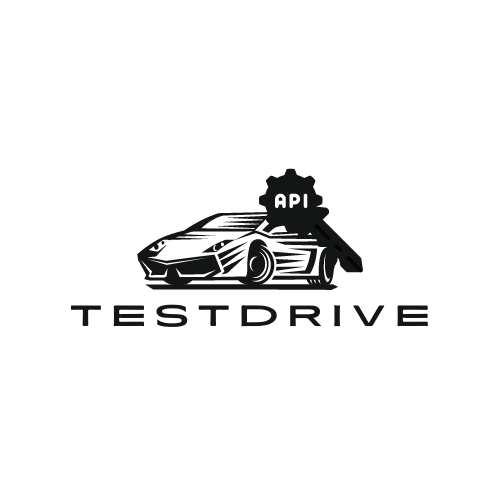

# Testdrive

<p align="center">
      
</p>

---

<h1>Welcome to Testdrive </h1>

### Overview

Testdrive is a framework designed to facilitate complete end-to-end API testing. It automates scheduled API tests and notifies users via Slack about any test failures. This README provides instructions on adding new APIs for testing, setting up Slack notifications, and running Testdrive locally and deploying to AWS (Lambda with event scheduler to run every 15 mins).

### Adding a New API

To add a new API for testing, follow these steps:

1. Ensure that the API you want to test implements the `Api` interface, as defined in `api.go`.
   
   ```go
   type Api interface {
       Name() string
       Test(client resty.Client, response chan<- Response)
   }

Here's high level overview on how to test your API (check comments api as an example for more details):

```go
package yourapipackage

import (
    "fmt"
    "github.com/arun0009/testdrive/env"
    "github.com/arun0009/testdrive/testdrive/api"
    "github.com/go-resty/resty/v2"
    "github.com/tidwall/gjson"
)

type Api struct {
}

func (a Api) Name() string {
    return "Your ApiName"
}

// Define API endpoints and corresponding tests

func (a Api) Test(client resty.Client, apiResponse chan<- api.Response) {
    // Implement API tests
}
```

2. Register your API in `/testdrive/testdrive.go`

```go 
    td.RegisterApi(yourapipackage.Api{})//you can inject any variables in API{}
```

Each API registered to test above is executed in parallel using go channels.

### Setting up Slack Notifications
To receive notifications about test failures via Slack, follow these steps:

Login to [Slack](https://www.slack.com) and create a Slack App/Channel to allow sending Slack messages on Testdrive failures.

Update `env.json` with your Slack Channel ID, OAuth Token (starts with xoxp) and API endpoint.

### Running Testdrive Locally

To run Testdrive Lambda locally, follow these steps:

* Install [aws-sam-cli](https://formulae.brew.sh/formula/aws-sam-cli)
* Install aws-cdk `npm install -g aws-cdk`

1. Create an env.json file in the root folder with the following contents:

```json
{
    "Parameters" : {
        "API_URL": "<api-url>",
        "CHANNEL_ID": "<slack-channel>",
        "SLACK_OAUTH_TOKEN": "<slack-oauth-token>"
    }
}
```

2. Use the `make invoke` command to run Testdrive Lambda locally.

3. To deploy Testdrive to AWS, use `make deploy`. Update export values with your AWS Account details in `Makefile`.

4. Console logs should display available endpoints for invocation.